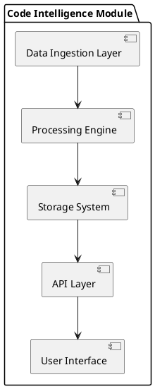

# System Architecture for Code Intelligence Module

## Overview
This document outlines the comprehensive architecture for the Code Intelligence Module integrated with RAJA OS. It provides insights into the core capabilities, module architecture, data flow, technology stack, scalability, integration, and security considerations.

## 1. Core Capabilities
- **Automated Code Discovery**: The module scans through repositories to identify code patterns, libraries, and dependencies automatically.
- **Intelligent Classification**: Employs machine learning algorithms to categorize code snippets based on their functionality.
- **Storage Layer**: Utilizes a robust database to manage and store code artifacts, metadata, and classifications effectively.
- **Query Interface**: Offers a user-friendly interface for querying code insights and metadata.

## 2. Module Architecture Components
- **Data Ingestion Layer**: Responsible for collecting code from various repositories.
- **Processing Engine**: Analyzes and processes code for classification and discovery.
- **Storage System**: A relational database (e.g., PostgreSQL) for structured data storage.
- **API Layer**: Facilitates interaction with the module through RESTful services.

## 3. Data Flow
1. Code repositories are scanned by the Data Ingestion Layer.
2. The Processing Engine analyzes the code and classifies it.
3. Results are stored in the Storage System.
4. Users can interact through the Query Interface to retrieve insights.

## 4. Technology Stack
- **Programming Languages**: Python, JavaScript
- **Frameworks**: Flask (API Layer), TensorFlow (Machine Learning)
- **Database**: PostgreSQL
- **Cloud Provider**: AWS or Azure for hosting services

## 5. Scalability Considerations
- Implementing microservices architecture to ensure horizontal scalability.
- Use of load balancers to distribute incoming traffic effectively.

## 6. Integration with RAJA OS
- The Code Intelligence Module will integrate seamlessly with RAJA OS via REST APIs, enabling communication and data exchange between modules.

## 7. Security Considerations
- Implementing OAuth 2.0 for secure access controls.
- Regular security audits and vulnerability assessments to ensure system integrity.

## 8. Future Enhancements
- Expanding machine learning capabilities for more accurate classifications.
- Enhancing the Query Interface for better user experience and performance.
- Integrating additional data sources for a richer code analysis.

## Diagrams

---

*Document generated on 2026-02-16 22:26:28.*